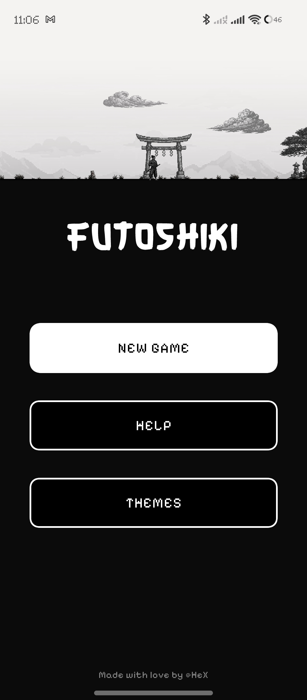
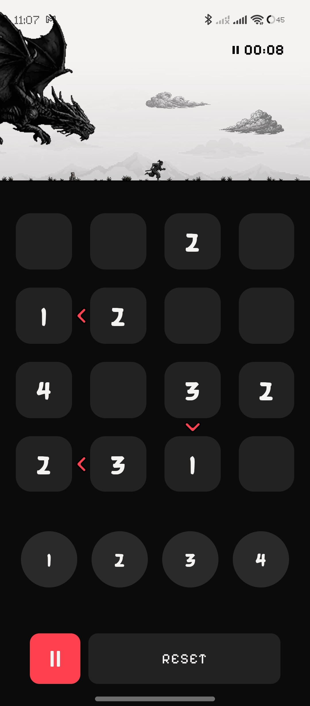
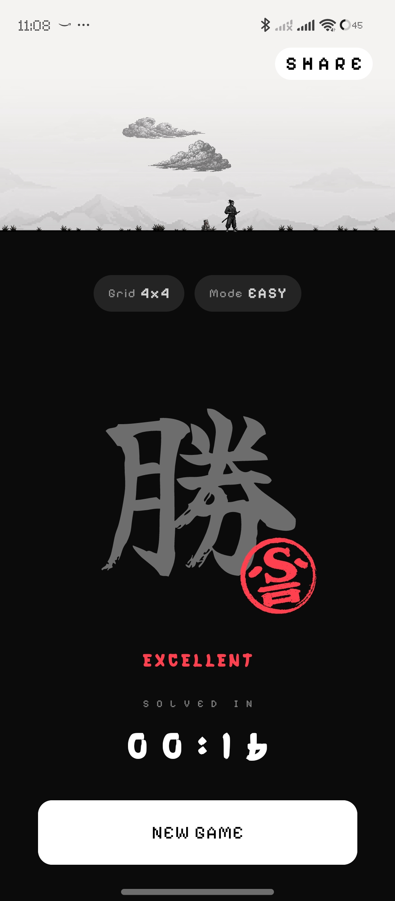
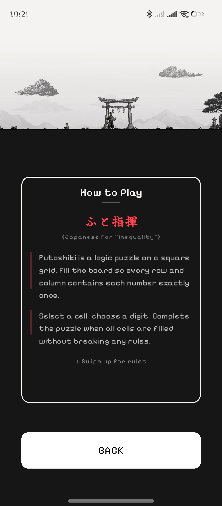

<p align="center">
  
</p>

<h1 align="center">Simple Futoshiki</h1>

<p align="center">
  <a href="https://f-droid.org/en/packages/com.hexcorp.futoshiki/">
    
  </a>
  <a href="LICENSE">
    
  </a>
  <a href="https://kotlinlang.org/">
    
  </a>
  <a href="https://github.com/samgrande/Simple-Futoshiki/releases">
    
  </a>
</p>

<p align="center">
  A clean and modern <strong>Futoshiki</strong> logic puzzle game built with <strong>Kotlin + Jetpack Compose</strong> and <strong>KorGE</strong>-powered animations.
</p>

<p align="center">
  <a href="https://f-droid.org/en/packages/com.hexcorp.futoshiki/">
    
  </a>
</p>

---

## What is Futoshiki?

Futoshiki is a Japanese logic puzzle played on a square grid. The objective is to fill the grid with numbers so that no digit repeats in any row or column, while satisfying the "greater than" (`>`) / "less than" (`<`) inequality constraints between adjacent cells.

---

## Screenshots

<p align="center">
  
  
  
  
</p>

---

## Features

- **Three grid sizes** (4×4, 5×5, 6×6) with Easy, Medium, and Hard difficulty
- **Material 3 interface** built entirely with Jetpack Compose
- **Unique-solution generator** with backtracking verification
- **Animated ninja vs dragon chase** powered by KorGE
- **Custom theming** with 4 color themes and multiple theme modes
- **Pause & resume** with timer and ranking system
- **No ads, no tracking, no network permissions** — only `VIBRATE` for haptic feedback

---

## Building

```bash
# Debug APK (for local testing)
./build.sh debug

# Release APK (unsigned — F-Droid signs with its own key)
./build.sh release

# Release AAB (for Play Store)
./build.sh aab
```

See [DEV-Notes.md](DEV-Notes.md) for detailed build instructions, keystore setup, and the release workflow.

---

## License

```
Copyright 2026 HeX

Licensed under the Apache License, Version 2.0 (the "License");
you may not use this file except in compliance with the License.
You may obtain a copy of the License at

    http://www.apache.org/licenses/LICENSE-2.0

Unless required by applicable law or agreed to in writing, software
distributed under the License is distributed on an "AS IS" BASIS,
WITHOUT WARRANTIES OR CONDITIONS OF ANY KIND, either express or implied.
See the License for the specific language governing permissions and
limitations under the License.
```
